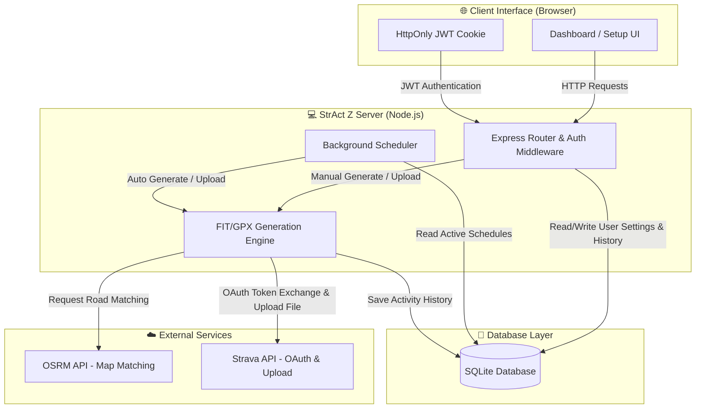
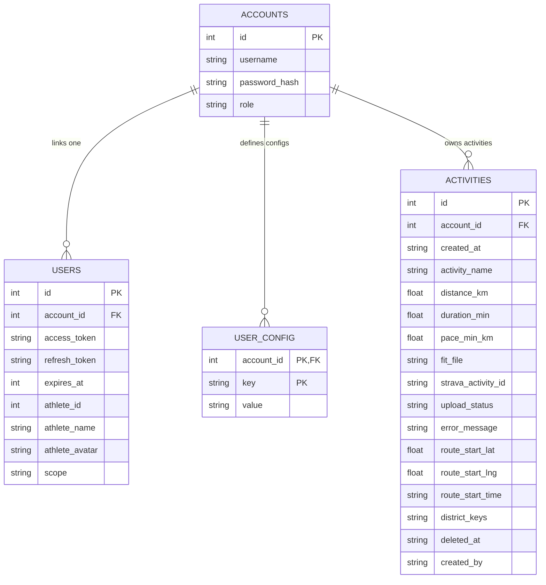
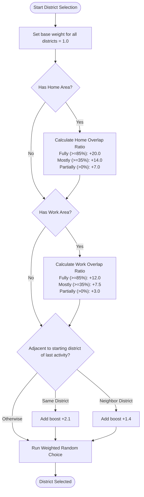
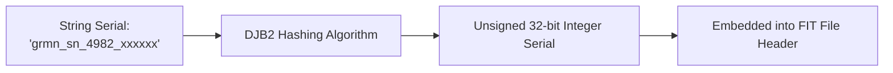

# 🏗️ StrAct Z - System Architecture

This document presents the system components, database schema, and core algorithms of StrAct Z in a fully visualized format.

---

## 🗺️ High-Level System Architecture

This diagram shows how the client browser, Node.js server components, SQLite database, and external APIs interact.



---

## 💾 Database ER Diagram

StrAct Z uses a multi-tenant SQLite database structure configured as follows:



---

## 🚀 Activity Generation Flowchart

The execution flow of the generation engine from trigger to the final output of a signed Garmin `.fit` or `.gpx` activity file.

```mermaid
graph TD
    %% Trigger Phase
    Start(["⚡ Trigger Activity Generation"]) --> InputCheck{"Manual or Scheduler?"}
    
    %% Setup & Custom Time Phase
    InputCheck -->|Manual| BuildManualConfig["Read UI parameters / Overrides"]
    InputCheck -->|Scheduler| BuildSchedulerConfig["Fetch DB User Settings & Check Slots"]
    
    BuildManualConfig --> TimingCheck{"Custom Time Active?"}
    BuildSchedulerConfig --> TimingCheck
    
    TimingCheck -->|Yes| SetCustomTime["Use Custom Date & Time<br/>Bypass random bounds"]
    TimingCheck -->|No| SetRandomTime["Select random time within bounds<br/>Check Avoid Workhours"]
    
    %% Target Distance Phase
    SetCustomTime --> TargetDistCheck{"Scheduler & Last Run of Day?"}
    SetRandomTime --> TargetDistCheck
    
    TargetDistCheck -->|Yes| CheckTargetDistance["Calculate distance done today<br/>Set target override +/- random variance"]
    TargetDistCheck -->|No| StandardDistance["Select random distance & pace<br/>Scale by activity type multiplier"]

    %% Overlap Protection Phase
    CheckTargetDistance --> OverlapCheck{"Overlap Protection Enabled?"}
    StandardDistance --> OverlapCheck
    
    OverlapCheck -->|Yes| QueryOverlap["Check conflict range:<br/>[Start - SafeTime - RestTime, End + SafeTime + RestTime]"]
    OverlapCheck -->|No| RoutingInit
    
    QueryOverlap --> OverlapConflict{"Conflict found?"}
    OverlapConflict -->|Yes| ErrorExit(["❌ Failed: Overlap Conflict"])
    OverlapConflict -->|No| RoutingInit
    
    %% Geography Phase
    RoutingInit["🎯 Determine Starting Coordinates"] --> FavorPOI{"Start Near Favorite POI?"}
    FavorPOI -->|Yes (70%)| PickPOI["Select coordinate from Scenic POIs in Hanoi"]
    FavorPOI -->|No (30%)| WeightedDistrict["Weighted Random District Selection"]
    
    PickPOI --> RouteGen
    WeightedDistrict --> PickRandomInPolygon["Select random coordinate inside district polygon"]
    PickRandomInPolygon --> RouteGen
    
    %% Routing Engine Phase
    RouteGen["🚲 Generate Route"] --> OSRMRoute{"Use OSRM Routing?"}
    OSRMRoute -->|Yes| CallOSRM["Fetch real road points from OSRM API"]
    OSRMRoute -->|No| FallbackGPS["Generate straight-line fallback nodes"]
    
    CallOSRM --> Resampling["Resample route coordinates to uniform 10m segments"]
    FallbackGPS --> Resampling
    
    %% Generation Phase
    Resampling --> SpeedCalcs["Determine pace & elevation grade"]
    SpeedCalcs --> TimestampGen["Generate timestamps rounded to nearest second<br/>Clamp grade slope to max 8%"]
    
    %% Device & Serialization Phase
    TimestampGen --> DeviceSelection["Resolve Watch Preset and Brand"]
    DeviceSelection --> SerialHash["Generate serial string & hash to uint32 via DJB2"]
    SerialHash --> LTSVersion["Lookup brand LTS software version"]
    LTSVersion --> WriteFIT["Write binary FIT or GPX file"]
    
    %% Save Phase
    WriteFIT --> SaveDB["Save local activity to DB as generated"]
    SaveDB --> DisableCustom["Turn off Custom Time in DB if enabled"]
    DisableCustom --> SuccessExit(["🎉 Output Activity File Ready"])
```

---

## 🏡 Weighted District Selection & Boost Logic

When selecting random starting coordinates outside Scenic POIs, districts are chosen using weights calculated from Home/Work coverage overlays and the starting district of the last uploaded/removed activity.



---

## ⚙️ Device Metadata Hashing

String serial numbers are converted to 32-bit unsigned integers using the DJB2 hashing algorithm to comply with Garmin FIT binary requirements.


