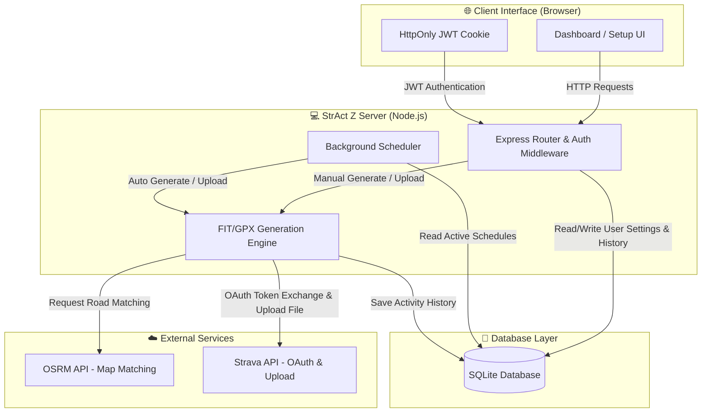
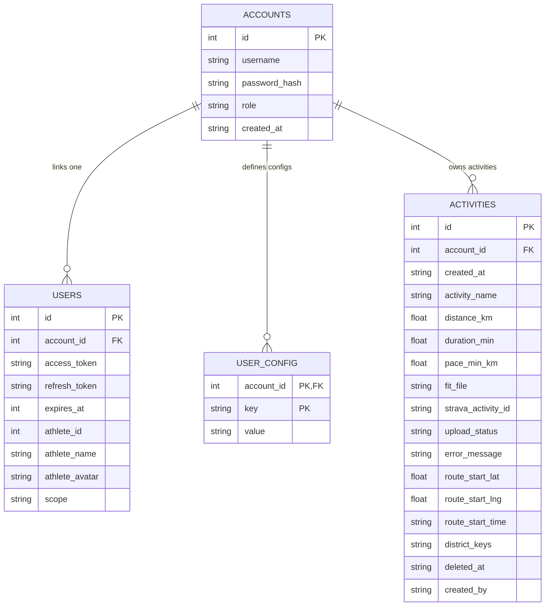
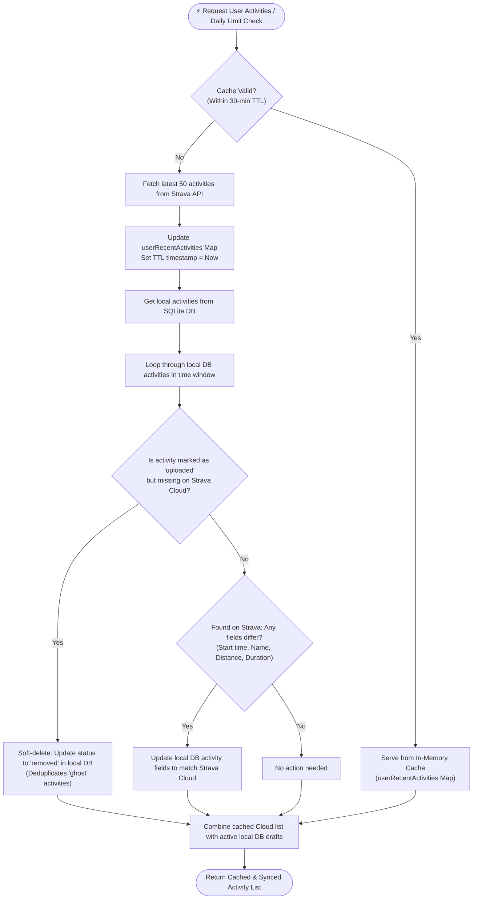

# 🏗️ StrAct Z - System Architecture

This document presents the system components, database schema, and core algorithms of StrAct Z in a fully visualized format.

---

## 🗺️ High-Level System Architecture

This diagram shows how the client browser, Node.js server components, SQLite database, and external APIs interact.

---

## 💾 Database ER Diagram

StrAct Z uses a multi-tenant SQLite database structure configured as follows:

---

## 🚀 Activity Generation & Routing Flowchart

This comprehensive flowchart details the entire execution flow from trigger to the final output of a signed Garmin `.fit` or `.gpx` activity file, including concurrency lock, daily limit checks, overlap protection, weighted district selection, favorite place start points, smart POI-to-POI routing, return probability rules, and biometrics simulation.

```mermaid
graph TD
    %% 1. Trigger & Limits
    subgraph Triggers ["⚡ Trigger, Schedule & Limits Evaluation"]
        Start(["⚡ Start Generation"]) --> Trigger{"Trigger Type?"}
        Trigger -->|Manual| ReadUI["Fetch User Config from DB<br/>& Read UI Parameters (Overrides)"]
        Trigger -->|Scheduler| ReadSettings["Fetch User Config from DB"]
        
        ReadSettings --> RandSchedules["Randomize count from min/max config &<br/>register Schedule 1 / 2 time slots"]
        
        ReadUI --> SyncCache["Fetch & Sync activities cache with Strava Cloud<br/>Soft-delete missing local 'uploaded' activities as 'removed'"]
        RandSchedules --> SyncCache
        
        SyncCache --> CheckLimit{"Daily Activity Limit Reached?<br/>(Active Local DB + Cached Strava Cloud today)"}
        
        CheckLimit -->|Yes| LimitReachedBranch{"Trigger Type?"}
        LimitReachedBranch -->|Manual| HandleManualLimit["If Upload requested: Show UI Error & Save FAILED Activity"]
        LimitReachedBranch -->|Scheduler| SaveFailedLimit["Create DB Activity with Status: FAILED<br/>(Exit scheduler loop)"]
        
        CheckLimit -->|No| CheckLock{"Is Scheduler?"}
        CheckLock -->|Yes| AcquireLock["Acquire Concurrency Lock<br/>(Placeholder: 'generating')"]
        CheckLock -->|No| DistanceMode
    end
    
    AcquireLock --> DistanceMode
    CheckLock -->|No| DistanceMode
    
    %% 2. Distance & Pace Selection
    subgraph DistanceSelection ["📏 Distance & Pace Selection"]
        DistanceMode{"Is Scheduler & Last Run of Day & Target Distance Enabled?"}
        TargetDistance["Calculate Remaining Target Distance today<br/>Set Distance to Remaining -100m to min_distance and +100m to max_distance"]
        StdDistance["Select Random Distance & Pace within limits<br/>Apply Activity Type Multipliers"]
        CalcDuration["Calculate Estimated Duration = Distance * Pace"]
        
        DistanceMode -->|Yes| TargetDistance
        DistanceMode -->|No| StdDistance
        
        TargetDistance --> CalcDuration
        StdDistance --> CalcDuration
    end
    
    CalcDuration --> TimingMode
    
    %% 3. Time Selection & Overlap Protection
    subgraph TimeSelection ["⏰ Time Selection & Overlap Protection"]
        TimingMode{"Custom Time Enabled?"}
        CustomTime["Use Exact Custom Date & Time<br/>Bypass Global Random Bounds"]
        RandomTime["Select Random Time within Bounds<br/>Check Avoid Workhours (T2-T6)"]
        
        CheckOverlap["Check Overlaps against active activities today<br/>Using active overlap buffers:<br/>- Safe Time (Fixed minutes buffer)<br/>- Rest Time (% of activity duration)<br/>(User can configure either, both, or none)"]
        
        OverlapConflict{"Conflict?<br/>(Falls inside [aStart - SafeTime - RestTime(a),<br/>aEnd + SafeTime + RestTime(a)] or new activity's rest overlaps)"}
        
        TimingMode -->|Yes| CustomTime
        TimingMode -->|No| RandomTime
        
        CustomTime --> CheckOverlap
        RandomTime --> CheckOverlap
        
        CheckOverlap --> OverlapConflict
    end
    
    OverlapConflict -->|Yes| SaveFailedOverlap["Set status to FAILED / Show UI Error"]
    OverlapConflict -->|No| SelectDistrict
    
    %% 4. District & Coordinate Selection
    subgraph Selection ["🎯 District & Start Coordinate Selection"]
        SelectDistrict["Calculate District Weights:<br/>- Base Weight = 1.0<br/>- Home Boost (Fully +20, Mostly +14, Partially +7)<br/>- Work Boost (Fully +12, Mostly +7.5, Partially +3)<br/>- Adjacent Boost (Same starting district +2.1, Neighbor +1.4)"]
        SelectDistrict --> RollDistrict["Select District via Weighted Random Selection"]
        RollDistrict --> FavorCheck{"Start Near Favorite Place Enabled?"}
        
        FavorCheck -->|Yes| RollFavorite{"Roll Start Point Type<br/>(Ratios scale by Home/Work presence)"}
        RollFavorite -->|Home-Work 40% to 60%| HomeWorkStart["Start near Home or Work coordinate<br/>(+ random 100m-300m offset)"]
        RollFavorite -->|"Scenic POI 35% to 80%"| POIStart["Start near Scenic POI coordinate<br/>(+ random 0m-200m offset)"]
        RollFavorite -->|"Random 5% to 20%"| PolygonStart["Start at true random point in district polygon<br/>(Rejection sampling with bbox fallback)"]
        
        FavorCheck -->|No| PolygonStart
    end
    
    HomeWorkStart --> RoutingEngine
    POIStart --> RoutingEngine
    PolygonStart --> RoutingEngine
    
    %% 5. Waypoint & Routing Engine
    subgraph Routing ["🚲 Route Generation & POI Targeting"]
        RoutingEngine{"Start Point Type?"}
        
        RoutingEngine -->|POI| POIRoll{"Roll POI-to-POI (60% Yes)"}
        RoutingEngine -->|"Home/Work"| HWRoll{"Roll POI Target (75% Yes)"}
        RoutingEngine -->|Random| RandRoll{"Roll POI Target (90% Yes)"}
        
        POIRoll -->|Yes| TargetPoiNear{"POI within 1.5km & fits distance limits?"}
        HWRoll -->|Yes| TargetPoiNear
        RandRoll -->|Yes| TargetPoiNear
        
        POIRoll -->|No| GeometricLoop["Generate Classic Loop/Out-Back Route around start"]
        HWRoll -->|No| GeometricLoop
        RandRoll -->|No| GeometricLoop
        
        TargetPoiNear -->|Yes| TargetPOI["Target neighboring POI"]
        TargetPoiNear -->|No| GeometricLoop
        
        TargetPOI --> RouteShape{"Generate Route Points"}
        GeometricLoop --> RouteShape
    end
    
    %% 6. Return & Stopping Probabilities
    subgraph ReturnProbabilities ["🔄 Return & Stopping Probability Logic"]
        ReturnCheck{"Start & End Combination?"}
        PoiToPoiReturn{"Roll Return (30% Return)"}
        HWToPoiReturn{"Roll Return (60% Return)"}
        RandToPoiReturn{"Roll Return (15% Return)"}
        DefaultLoopReturn{"Roll Return (50% Return)"}
        
        StopPoi["Stop/Detour at second POI (outbound path only)"]
        LoopBack["Loop back to starting point"]
        StopRand["Stop at random point (outbound path only)"]
        
        RouteShape --> ReturnCheck
        
        ReturnCheck -->|POI-to-POI| PoiToPoiReturn
        PoiToPoiReturn -->|70% Stop| StopPoi
        PoiToPoiReturn -->|30% Return| LoopBack
        
        ReturnCheck -->|Home/Work-to-POI| HWToPoiReturn
        HWToPoiReturn -->|40% Stop/Detour| StopPoi
        HWToPoiReturn -->|60% Return| LoopBack
        
        ReturnCheck -->|Random-to-POI| RandToPoiReturn
        RandToPoiReturn -->|85% Stop| StopPoi
        RandToPoiReturn -->|15% Return| LoopBack
        
        ReturnCheck -->|Default Loop - No POI| DefaultLoopReturn
        DefaultLoopReturn -->|50% P2P| StopRand
        DefaultLoopReturn -->|50% Return| LoopBack
    end
    
    StopPoi --> RoadSnapping
    StopRand --> RoadSnapping
    LoopBack --> RoadSnapping
    
    %% 7. Snapping & Simulation
    subgraph Simulation ["🛣️ Road Snapping & Biometrics Simulation"]
        RoadSnapping{"Use Snap OSRM Routing?"}
        RoadSnapping -->|Yes| OSRMCall["Fetch real road points from OSRM API"]
        RoadSnapping -->|No| FallbackLine["Fetch straight-line GPS points"]
        
        OSRMCall --> Resampling["Resample coordinates to uniform 10m spacing"]
        FallbackLine --> Resampling
        
        Resampling --> HRZone["Calculate Target Heart Rate Zone by Activity Type:<br/>- Walk: 45-65% MHR<br/>- Ride: 55-75% MHR<br/>- Run: 65-90% MHR"]
        HRZone --> SimulationRuns["Simulate Pace & biometrics:<br/>- 30% Hot Weather (+5 to 15 BPM)<br/>- 1.5% Red Light Stop (rest 15-60s, HR drops)<br/>- Elevation grade clamped to max 8%"]
    end
    
    SimulationRuns --> BuildFormat
    
    %% 8. File Encoding & Export
    subgraph Export ["💾 File Generation & Device Mapping"]
        BuildFormat{"Export Format?"}
        BuildFormat -->|FIT| FitWriter["Encode binary FIT format"]
        BuildFormat -->|GPX| GpxWriter["Encode GPX format"]
        
        FitWriter --> DeviceMapping["Map Device Details:<br/>- Garmin: Set Manufacturer (1) & Product ID Enum<br/>- Non-Garmin: Set Manufacturer, Product (undefined), product_name in device_info<br/>- Serial: Hash serial string to uint32 (DJB2)"]
        GpxWriter --> DeviceMapping
        
        DeviceMapping --> SaveActivity["Save to SQLite DB with status: generated / uploaded"]
        SaveActivity --> ClearCustomTime["Disable Custom Time in user_config"]
    end
    
    ClearCustomTime --> End(["🎉 Output Activity Ready"])
    SaveFailedLimit --> End
    SaveFailedOverlap --> End
    HandleManualLimit --> End
```

---

## 🔄 Centralized Cache & Cloud Sync Flowchart

This diagram explains the synchronization layer between local SQLite DB and Strava Cloud. It maps out how the in-memory cache behaves, when updates are fetched, and how "ghost" activities (removed from Strava) are soft-deleted locally.

