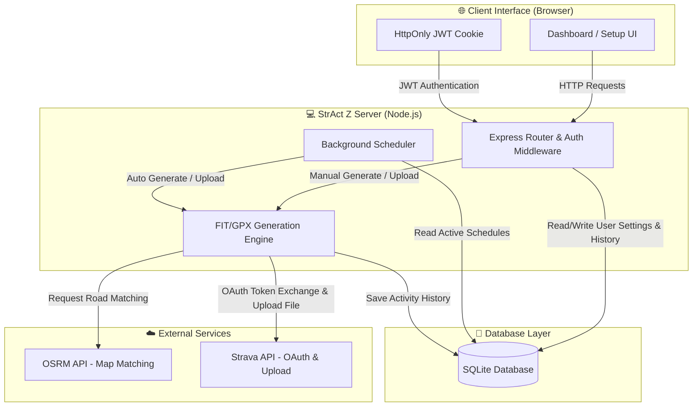
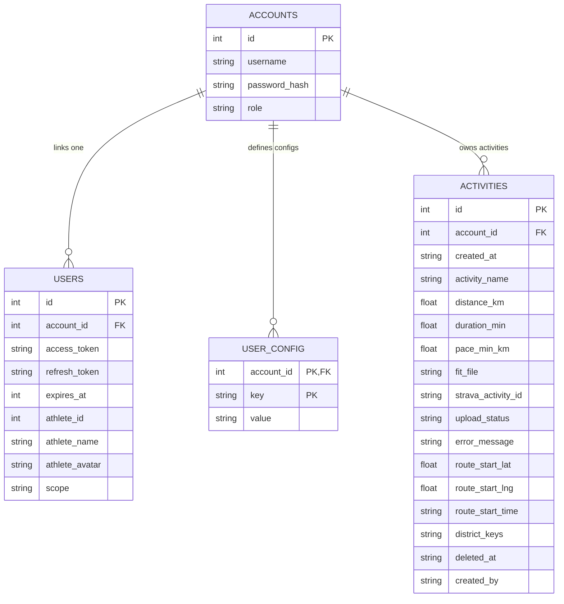
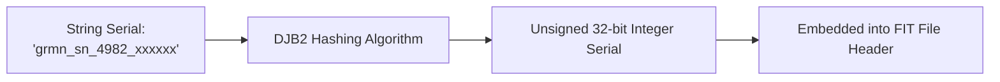

# 🏗️ StrAct Z - System Architecture

This document presents the system components, database schema, and core algorithms of StrAct Z in a fully visualized format.

---

## 🗺️ High-Level System Architecture

This diagram shows how the client browser, Node.js server components, SQLite database, and external APIs interact.



---

## 💾 Database ER Diagram

StrAct Z uses a multi-tenant SQLite database structure configured as follows:



---

## 🚀 Activity Generation Flowchart

The execution flow of the generation engine from trigger to the final output of a signed Garmin `.fit` or `.gpx` activity file.

```mermaid
graph TD
    %% Trigger Phase
    Start(["⚡ Trigger Activity Generation"]) --> InputCheck{"Manual or Scheduler?"}
    
    %% Setup & Custom Time Phase
    InputCheck -->|Manual| BuildManualConfig["Read UI parameters / Overrides"]
    InputCheck -->|Scheduler| BuildSchedulerConfig["Fetch DB User Settings & Check Slots"]
    
    BuildManualConfig --> TimingCheck{"Custom Time Active?"}
    BuildSchedulerConfig --> TimingCheck
    
    TimingCheck -->|Yes| SetCustomTime["Use Custom Date & Time<br/>Bypass random bounds"]
    TimingCheck -->|No| SetRandomTime["Select random time within bounds<br/>Check Avoid Workhours"]
    
    %% Target Distance Phase
    SetCustomTime --> TargetDistCheck{"Scheduler & Last Run of Day?"}
    SetRandomTime --> TargetDistCheck
    
    TargetDistCheck -->|Yes| CheckTargetDistance["Calculate distance done today<br/>Set target override +/- random variance"]
    TargetDistCheck -->|No| StandardDistance["Select random distance & pace<br/>Scale by activity type multiplier"]

    %% Overlap Protection Phase
    CheckTargetDistance --> OverlapCheck{"Overlap Protection Enabled?"}
    StandardDistance --> OverlapCheck
    
    OverlapCheck -->|Yes| QueryOverlap["Check conflict range:<br/>[Start - SafeTime - RestTime, End + SafeTime + RestTime]"]
    OverlapCheck -->|No| RoutingInit
    
    QueryOverlap --> OverlapConflict{"Conflict found?"}
    OverlapConflict -->|Yes| ErrorExit(["❌ Failed: Overlap Conflict"])
    OverlapConflict -->|No| RoutingInit
    
    %% Geography Phase
    RoutingInit["🎯 Determine Starting Coordinates"] --> FavorPOI{"Start Near Favorite POI?"}
    FavorPOI -->|Yes (70%)| PickPOI["Select coordinate from Scenic POIs in Hanoi"]
    FavorPOI -->|No (30%)| WeightedDistrict["Weighted Random District Selection"]
    
    PickPOI --> RouteGen
    WeightedDistrict --> PickRandomInPolygon["Select random coordinate inside district polygon"]
    PickRandomInPolygon --> RouteGen
    
    %% Routing Engine Phase
    RouteGen["🚲 Generate Route"] --> OSRMRoute{"Use OSRM Routing?"}
    OSRMRoute -->|Yes| CallOSRM["Fetch real road points from OSRM API"]
    OSRMRoute -->|No| FallbackGPS["Generate straight-line fallback nodes"]
    
    CallOSRM --> Resampling["Resample route coordinates to uniform 10m segments"]
    FallbackGPS --> Resampling
    
    %% Generation Phase
    Resampling --> SpeedCalcs["Determine pace & elevation grade"]
    SpeedCalcs --> TimestampGen["Generate timestamps rounded to nearest second<br/>Clamp grade slope to max 8%"]
    
    %% Device & Serialization Phase
    TimestampGen --> DeviceSelection["Resolve Watch Preset and Brand"]
    DeviceSelection --> SerialHash["Generate serial string & hash to uint32 via DJB2"]
    SerialHash --> LTSVersion["Lookup brand LTS software version"]
    LTSVersion --> WriteFIT["Write binary FIT or GPX file"]
    
    %% Save Phase
    WriteFIT --> SaveDB["Save local activity to DB as generated"]
    SaveDB --> DisableCustom["Turn off Custom Time in DB if enabled"]
    DisableCustom --> SuccessExit(["🎉 Output Activity File Ready"])
```

---

## 🏡 Weighted District Selection & Boost Logic

When selecting random starting coordinates outside Scenic POIs, districts are chosen using weights calculated from Home/Work coverage overlays and the starting district of the last uploaded/removed activity.


---

## ⚙️ Device Metadata Hashing

String serial numbers are converted to 32-bit unsigned integers using the DJB2 hashing algorithm to comply with Garmin FIT binary requirements.



---

## 🔍 Garmin FIT SDK & ANT+ Device Mapping & Time Standards

Dựa trên tài liệu chính thống của **Garmin FIT SDK** và **ANT+ Alliance (thisisant.com)**, dưới đây là các phát hiện quan trọng phục vụ cho việc sinh tệp FIT chuẩn hóa trên hệ thống:

### 1. Cơ chế ánh xạ Thiết bị (Device Mapping Rule)
* **Manufacturer ID (Mã nhà sản xuất)**: Được cấp phát độc quyền bởi ANT+ Alliance cho các hãng thành viên. Việc gửi đúng ID này là điều kiện tiên quyết để Strava hiển thị đúng logo thương hiệu và Sync Badge của ứng dụng kết nối tương ứng (ví dụ: `Zepp App` cho Amazfit, `Huawei Health` cho Huawei).
* **Product ID (Mã sản phẩm)**:
  * **Đối với Garmin (Manufacturer = 1)**: FIT SDK định nghĩa một danh sách Enum cụ thể (gọi là `garmin_product`). Gửi đúng mã sản phẩm (ví dụ: `4376` cho fēnix 7x Pro, `4315` cho Forerunner 965) sẽ giúp Strava map trực tiếp thiết bị đó từ database.
  * **Đối với các hãng phi-Garmin (Huawei, Coros, Amazfit, Suunto)**: ANT+ không quản lý Product ID của họ trong FIT SDK. 
  * **Bí quyết map thiết bị phi-Garmin**: Khi tạo tệp FIT, nếu thuộc tính `product` được bỏ qua hoặc để `undefined` trong message `file_id` and `device_info`, Strava sẽ tự động kích hoạt cơ chế Fallback: đối chiếu dựa trên thuộc tính **`product_name`** trong message **`device_info`** để hiển thị đúng tên thiết bị trên giao diện. Điều này giúp sửa lỗi thiết bị phi-Garmin bị nhận diện sai hoặc bị ẩn tên.

### 2. Các tham số định danh chuẩn theo tài liệu FIT SDK
Danh sách Manufacturer ID & Product ID chuẩn hóa cho các dòng thiết bị phổ biến được tích hợp vào hệ thống:
* **Garmin (Manufacturer: 1)**
  * fēnix 7: `3906` | fēnix 7x Pro: `4376`
  * fēnix 8: `4536` | fēnix 8 Solar: `4533`
  * Forerunner 945: `3113` | Forerunner 935: `2691`
  * Forerunner 955: `4024` | Forerunner 965: `4315`
  * Forerunner 255: `3992` | Forerunner 255S: `3993`
  * Forerunner 265: `4257` | Forerunner 165: `4432`
  * Venu 2: `3703` | Venu 2S: `3704` | Venu 2 Plus: `3851` | Venu Sq 2: `4115`
  * Instinct 2X Solar: `4394` | Epix Pro (Gen 2): `4313`
  * Garmin Connect app: `undefined` (hiển thị nguồn đồng bộ chung của Garmin)
* **COROS (Manufacturer: 294)**: Product `undefined` (nhận diện qua tên thiết bị)
* **Amazfit / Zepp (Manufacturer: 339)**: Product `undefined` (nhận diện qua tên thiết bị)
* **Huawei (Manufacturer: 348)**: Product `undefined` (nhận diện qua tên thiết bị)
* **Suunto (Manufacturer: 23)**: Product `undefined` (nhận diện qua tên thiết bị)
* **Strava (Manufacturer: 265)**: Product `265` (hoạt động ghi nhận trực tiếp bằng ứng dụng Strava)

### 3. Chuẩn hóa thời gian (Time Standard) trong tệp FIT
* Mọi timestamp trong tệp FIT (`time_created`, `start_time`, `timestamp`) bắt buộc phải theo định dạng **giây kể từ kỷ nguyên FIT epoch** (00:00:00 UTC ngày 31/12/1989).
* Để Strava hiểu đúng múi giờ hiển thị của hoạt động, message `activity` cần ghi nhận thuộc tính `local_timestamp`. Đây là thời gian local tính bằng giây từ FIT epoch (bằng thời gian UTC cộng thêm offset múi giờ). Với múi giờ Việt Nam (GMT+7), công thức `local_timestamp = start_time + 7 * 3600` đang được áp dụng chuẩn xác.

